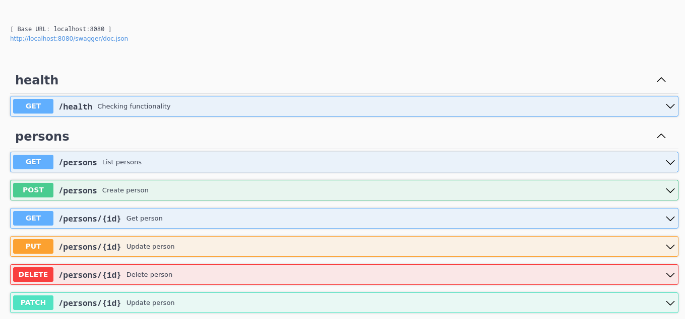

## Сервис записная книга

Реализовать сервис, который будет получать по API ФИО, из открытых API обогащать ответ
наиболее вероятными возрастом, полом и национальностью и сохранять данные в БД. По
запросу выдавать информацию о найденных людях. Сервер должен реализовать 7 методов и
их логику:

#### Проверка работоспособности
- Эндпоинт - GET /health
- Статус ответа 200 если сервис работает исправно

##### Пример
```bash
$ curl -i -X GET 'http://localhost:8080/health'

{
  "status": "OK"
}
```

#### Создание персоны
 - Эндпоинт: POST /persons
 - Параметры запроса:
    - JSON-объект в теле запроса с параметрами:
        - name - имя персоны
        - surname - фамилия персоны
        - patronymic - отчество персоны (необязательно)
 - Ответ содержит JSON-объект:
    - id – ID персоны. Генерируется сервером
 - Корректное сообщение обогатить наиболее вероятными:
    - Возрастом - [api.agify.io](https://api.agify.io/?name=Dmitriy) 
    - Полом - [api.genderize.io](https://api.genderize.io/?name=Dmitriy)
    - Национальностью - [api.nationalize.io](https://api.nationalize.io/?name=Dmitriy)

##### Пример
```bash
$ curl -i -X POST http://localhost:8080/persons \
-H "Content-Type: application/json" \
-d '{
	"name": "Dmitriy",
	"surname": "Ushakov",
	"patronymic": "Vasilevich"
}'

{
  "id": 1,
  "status": "OK"
}
```

#### Получение информации о персоне
 - Эндпоинт - GET /persons/{id}
 - Параметры запроса:
    - id – ID персоны, указан в пути запроса
 - Ответ содержит JSON-объект:
    - id - ID персоны
    - name - имя персоны
    - surname - фамилия персоны
    - patronymic - отчество персоны (необязательно)
    - age - возраст
    - gender - пол
    - country_id - код страны (национальность)

##### Пример
```bash
$ curl -i -X GET http://localhost:8080/persons/1

{
  "id": 1,
  "name": "Dmitriy",
  "surname": "Ushakov",
  "patronymic": "Vasilevich",
  "age": 44,
  "gender": "male",
  "country_id": "UA"
}
```

#### Обновление персоны
 - Эндпоинт – PUT /persons/{id}
 - Параметры запроса:
    - id – ID персоны, указан в пути запроса
    - JSON-объект в теле запроса с параметрами:
        - name - имя персоны
        - surname - фамилия персоны
        - patronymic - отчество персоны
        - age - возраст
        - gender - пол
        - country_id - код страны (национальность)

##### Пример
```bash
$ curl -i -X PUT http://localhost:8080/persons/1 \
-H "Content-Type: application/json" \
-d '{
	"name": "Ivan",
	"surname": "Ivanov",
	"patronymic": "Ivanovich",
	"age": 22,
	"gender": "male",
	"country_id": "RU"
}'

{
  "status": "OK"
}
```

#### Обновление отдельных полей персоны
 - Эндпоинт – PATCH /persons/{id}
 - Параметры запроса:
    - id – ID персоны, указан в пути запроса
    - JSON-объект в теле запроса с параметрами:
        - name - имя персоны (необязательно)
        - surname - фамилия персоны (необязательно)
        - patronymic - отчество персоны (необязательно)
        - age - возраст (необязательно)
        - gender - пол (необязательно)
        - country_id - код страны (национальность, необязательно)

##### Пример
```bash
$ curl -i -X PATCH http://localhost:8080/persons/1 \
-H "Content-Type: application/json" \
-d '{
	"name": "Ivan",
	"surname": "Ivanov",
	"patronymic": "Ivanovich",
	"age": 22,
	"gender": "male",
	"country_id": "RU"
}'

{
  "status": "OK"
}
```

#### Удаление персоны
 - Эндпоинт – DELETE /persons/{id}
 - Параметры запроса:
    - id – ID персоны, указан в пути запроса

##### Пример
```bash
$ curl -i -X DELETE http://localhost:8080/persons/1

{
  "status": "OK"
}
```

#### Получение списка всех персон
 - Эндпоинт – GET /persons
 - Параметры запроса:
    - limit – количество персон в ответе (по умолчанию 100)
    - offset - смищение от начала (по умолчанию 0)
    - age_from - возрост от которого включать в ответ
    - age_to - возрост до которого включать в ответ
    - gender - фильтр по полу (male/female)
    - country_id - фильтр коду страны
 - Ответ должен содержать в теле массив JSON-объектов с всеми персонами. Каждый объект содержит параметры:
    - id - ID персоны
    - name - имя персоны
    - surname - фамилия персоны
    - patronymic - отчество персоны (необязательно)
    - age - возраст
    - gender - пол
    - country_id - код страны (национальность)

##### Пример
```bash
$ curl -i -X GET 'http://localhost:8080/persons?limit=10&offset=0&age_from=18&age_to=100&gender=male&country_id=RU'

{
  "persons": [
    {
      "id": 1,
      "name": "Dmitriy",
      "surname": "Ushakov",
      "patronymic": "Vasilevich",
      "age": 43,
      "gender": "male",
      "country_id": "UA"
    }
  ],
  "status": "OK"
}
```
#### Документация OpenAPI
 - Эндпоинт – GET /swagger/index.html


### Сборка и запуск приложения в Docker Compose

```shell script
$ make run
...............
```

## Структура проекта
```bash
$ tree .
.
├── cmd
│   └── persons-server
│       ├── Dockerfile
│       ├── main.go
│       └── Makefile
├── configs
│   ├── persons.env
│   └── postgres.env
├── deployments
│   └── docker-compose.yaml
├── docs
│   ├── docs.go
│   ├── swagger.json
│   ├── swagger.png
│   └── swagger.yaml
├── go.mod
├── go.sum
├── internal
│   ├── config
│   │   └── config.go
│   ├── enrich
│   │   └── enrich.go
│   ├── httpserver
│   │   ├── handlers
│   │   │   ├── health
│   │   │   │   └── health.go
│   │   │   └── person
│   │   │       ├── create
│   │   │       │   └── create.go
│   │   │       ├── deletep
│   │   │       │   └── delete.go
│   │   │       ├── get
│   │   │       │   └── get.go
│   │   │       ├── list
│   │   │       │   └── list.go
│   │   │       ├── update
│   │   │       │   └── update.go
│   │   │       └── updatefull
│   │   │           └── updatefull.go
│   │   └── server.go
│   ├── logger
│   │   └── logger.go
│   └── storage
│       ├── sql
│       │   ├── create.go
│       │   ├── delete.go
│       │   ├── get.go
│       │   ├── list.go
│       │   ├── storage.go
│       │   ├── updatefull.go
│       │   └── update.go
│       └── storage.go
├── Makefile
├── migrations
│   ├── 000001_init_schema.down.sql
│   └── 000001_init_schema.up.sql
├── pkg
│   ├── http
│   │   ├── logger
│   │   │   └── logger.go
│   │   └── response
│   │       └── response.go
│   └── retry
│       └── retry.go
└── README.md
```

### Полезные ссылки
- [Пример 1](https://github.com/fprofit/EffectiveMobile)
- [Пример 2](https://github.com/kozyrev-m/effective-mobile-task)
- [Пример 3](https://github.com/alukart32/effective-mobile-test-task)
